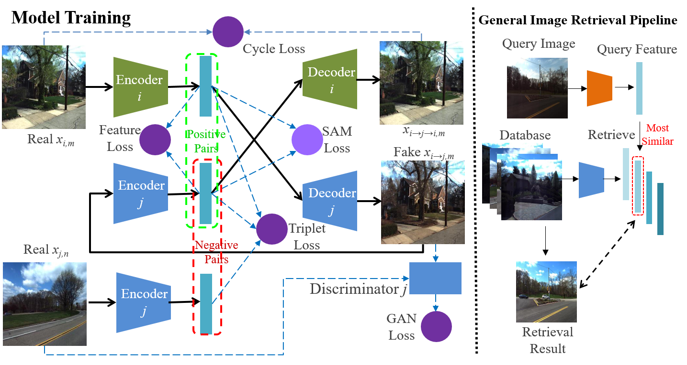
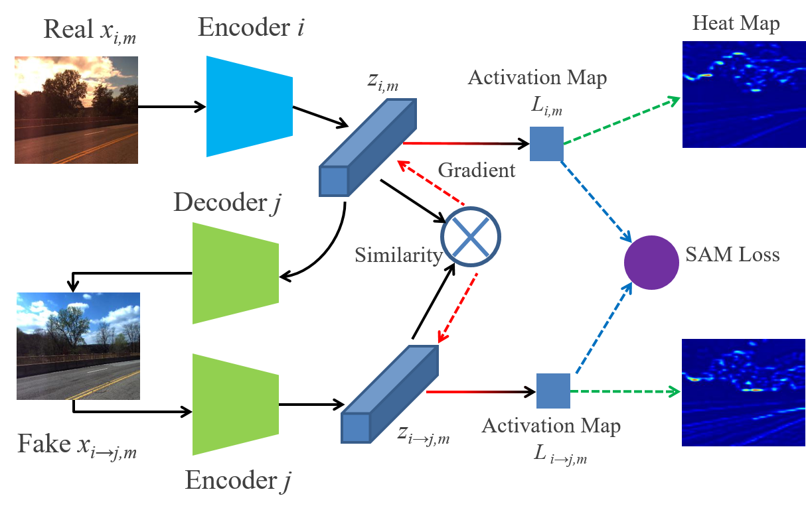

# DISAM: Domain-invariant Similarity Activation Map Metric Learning for  Retrieval-based Long-term  Visual Localization

This is our Pytorch implementation for DISAM ([arxiv](https://arxiv.org/pdf/2009.07719.pdf)) as an extended version of DIFL-FCL ([paper](https://ieeexplore.ieee.org/document/8968047),[code](https://github.com/HanjiangHu/DIFL-FCL)) 



<br><br>



## Prerequisites
- Linux or macOS
- Python 3
- CPU or NVIDIA GPU + CUDA CuDNN

## Getting Started
### Installation
- Install requisite Python libraries.
```bash
pip install torch
pip install torchvision
pip install visdom
pip install dominate
```
- Clone this repo:
```bash
git clone https://github.com/HanjiangHu/DISAM.git
```

### Training

The datasets used to train and test in this paper are well organized [HERE](https://drive.google.com/file/d/1vtsZMOvQ9ZK_YBI73vodrqVLM3i2t0WA/view?usp=sharing). Please uncompress it under the root path.

Some of our pretrained models for the CMU-Seasons dataset are found [HERE](https://drive.google.com/file/d/1YM_kkVkwNpVXV8Iv38JjEZImcDYLdHsZ/view?usp=sharing). Please make a new directory `./checkpoints`  under the root path and uncompress it under `./checkpoints`. The pre-trained models for RobotCar Dataset are originated from models from CMU folders and have been already transferred according to the environment correspondence in `Table Ⅰ` of the paper. The pre-trained image translation models at epoch 300 could be moved to any other folder to fine-tune using Urban images of CMU-Seasons Dataset.

Training on Urban area of CMU-Seasons Dataset:
- Fine-tune a coarse model from epoch 300:
```
python train.py --name CMU_coarse --dataroot the/path/to/CMU_urban --n_domains 12 --niter XXX --niter_decay XXX --gpu_ids 0 --lambda_sam 0.0 --continue_train --which_epoch 300 
```
- Fine-tune a fine model from epoch 300:
```
python train.py --name CMU_fine --dataroot the/path/to/CMU_urban --n_domains 12 --niter XXX --niter_decay XXX --gpu_ids 0 --train_using_cos --mean_cos --use_cos_latent_with_L2 --continue_train --which_epoch 300 
```
### Testing
Testing on CMU-Seasons Dataset:
- Test the coarse model:
```
python test.py --phase test --name CMU_coarse --dataroot the/path/to/CMU_AREA --n_domains 12 --which_epoch 1200 --serial_test --gpu_ids 0 --which_slice XX --test_using_cos --mean_cos
```
- Test the fine model:
```
python test.py --phase test --name CMU_fine --dataroot the/path/to/CMU_AREA --n_domains 12 --which_epoch 1200 --serial_test --gpu_ids 0 --which_slice XX --test_using_cos
```
- Test the coarse-to-fine pipeline:
```
python test.py --phase test --name CMU_coarse --dataroot the/path/to/CMU_AREA --n_domains 12 --which_epoch 1200 --use_two_stage --top_n 3 --name_finer CMU_fine --which_epoch_finer 1200 --serial_test --gpu_ids 0 --which_slice XX --test_using_cos --mean_cos 
```
Testing on RobotCar Dataset:
- Build the feature database:
```
python save_database_feature.py --phase test --name robotcar_coarse --dataroot the/path/to/RobotCar_rear --n_domains 10 --which_epoch 1200 --serial_test --gpu_ids 0 --test_using_cos --mean_cos --use_two_stage --name_finer robotcar_fine --which_epoch_finer 1200 
```
- Test the coarse model:
```
python test_robotcar.py --phase test --name robotcar_coarse --dataroot the/path/to/RobotCar_rear --n_domains 10 --which_epoch 1200 --serial_test --gpu_ids 0 --test_using_cos --test_condition XX --mean_cos
```
- Test the fine model:
```
python test_robotcar.py --phase test --name robotcar_fine --dataroot the/path/to/RobotCar_rear  --n_domains 10 --which_epoch 1200 --serial_test --gpu_ids 0 --test_using_cos --only_for_finer --resize64 --test_condition XX --mean_cos
```

### Results
The test results will be saved to the root path. The txt results should be merged into a single txt file and submitted to [the official benchmark website](https://www.visuallocalization.net/submission/).

Our [coarse-only](https://www.visuallocalization.net/details/13316/), [fine-only](https://www.visuallocalization.net/details/13379/) and [coarse-to-fine](https://www.visuallocalization.net/details/13380/) results on CMU-Seasons Dataset could be found on the benchmark website.
Our [coarse-only](https://www.visuallocalization.net/details/13383/) and [fine-only](https://www.visuallocalization.net/details/13482/) results on RobotCar Dataset could be found on the benchmark website as well.


## Other Details
- See `options/train_options.py` for training-specific flags, `options/test_options.py` for test-specific flags on CMU-Seasons Dataset, `options/RobotcarTestOptions.py` for test-specific flags on RobotCar Dataset, and `options/base_options.py` for all common flags.
- CPU/GPU (default `--gpu_ids 0`): set`--gpu_ids -1` to use CPU mode; set `--gpu_ids 0,1,2` for multi-GPU mode.
- More details could be found in [DIFL-FCL](https://github.com/HanjiangHu/DIFL-FCL)


If you use this code in your own work, please cite:

H. Hu, H. Wang, Z. Liu, and W. Chen
”[Domain-invariant Similarity Activation Map Metric Learning for  Retrieval-based Long-term  Visual Localization](https://arxiv.org/pdf/2009.07719.pdf)”,  

```
@misc{hu2020domaininvariant,
    title={Domain-invariant Similarity Activation Map Metric Learning for Retrieval-based Long-term Visual Localization},
    author={Hanjiang Hu and Hesheng Wang and Zhe Liu and Weidong Chen},
    year={2020},
    eprint={2009.07719},
    archivePrefix={arXiv},
    primaryClass={cs.CV}
}
```

H. Hu, H. Wang, Z. Liu, C. Yang, W. Chen, and L. Xie
”[Retrieval-based Localization Based on Domain-invariant Feature Learning under Changing Environments](https://ieeexplore.ieee.org/document/8968047)”,  
IROS 2019

```
@inproceedings{hu2019DIFLFCL, 
  author={H. {Hu} and H. {Wang} and Z. {Liu} and C. {Yang} and W. {Chen} and L. {Xie}}, 
  booktitle={2019 IEEE/RSJ International Conference on Intelligent Robots and Systems (IROS)}, 
  title={Retrieval-based Localization Based on Domain-invariant Feature Learning under Changing Environments}, 
  year={2019}, 
  pages={3684-3689}
}
```
